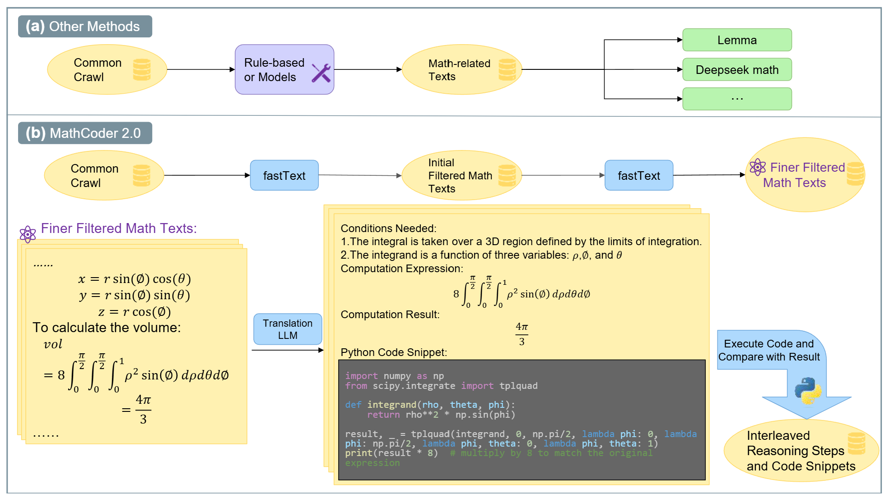
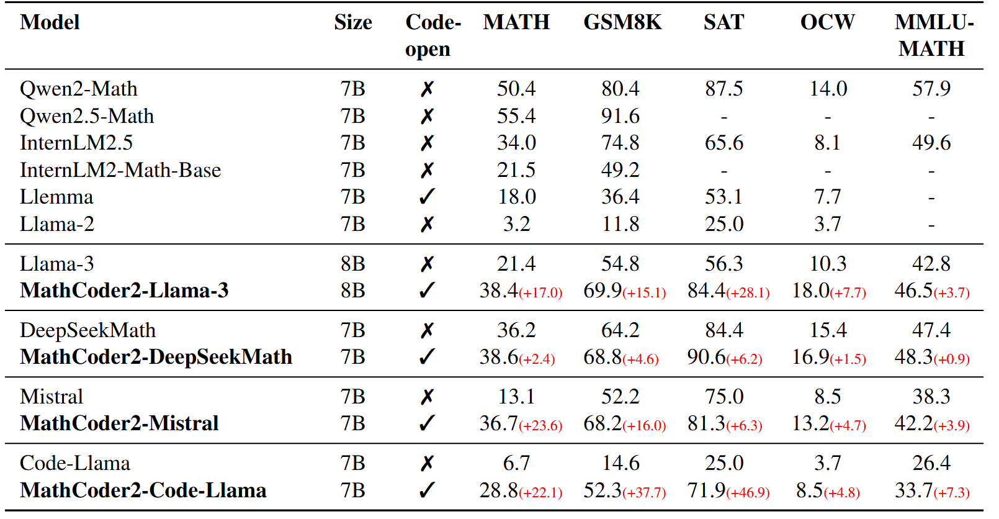

# MathCoder2

This repository contains files for data processing and continued pretraining to reproduce the paper ["MathCoder2: Better Math Reasoning from Continued Pretraining on Model-translated Mathematical Code"](https://arxiv.org/abs/2410.08196).

<br>
<div align="center">
    
</div>

<p align="center">
        🤗 <a href="https://huggingface.co/collections/MathGenie/mathcoder2-66fa178501ab1cdf36637f83">Hugging Face</a>&nbsp&nbsp | &nbsp&nbsp 📑 <a href="https://arxiv.org/abs/2410.08196">Paper</a> &nbsp&nbsp ｜ &nbsp&nbsp📖 <a href="https://mathllm.github.io/mathcoder2/">Project Page</a>
</p>

## Dataset and Models

Our dataset, MathCode-Pile is released at [MathCode-Pile](https://huggingface.co/datasets/MathGenie/MathCode-Pile). Currently, only part of the dataset is released. You can generate the rest using the code in this repository. The full dataset will be released later.

The MathCoder2 models are as follows:

|Model Name|Huggingface Link|
|:--|:--|
|MathCoder2-Llama-3-8B|🤗 [link](https://huggingface.co/MathGenie/MathCoder2-Llama-3-8B)|
|MathCoder2-DeepSeekMath-7B|🤗 [link](https://huggingface.co/MathGenie/MathCoder2-DeepSeekMath-7B)|
|MathCoder2-Mistral-7B|🤗 [link](https://huggingface.co/MathGenie/MathCoder2-Mistral-7B)|
|MathCoder2-CodeLlama-7B|🤗 [link](https://huggingface.co/MathGenie/MathCoder2-CodeLlama-7B)|

## Introduction

Although utilizing existing open-source code in the pretraining phase can enhance the mathematical reasoning abilities of LLMs, such code often lacks accompanying natural language explanations or context. This might hinder the model's ability to fully understand them. In this paper, we propose a novel method for *generating large amounts  of mathematical code accompanied by corresponding natural language reasoning steps*, which are extracted from math-related pretraining texts. Different from the existing math-related code, our generated code is paired with natural language reasoning steps, making the code more comprehensible. Also, as our code is generated based on math-related texts, they are all highly related to mathematical reasoning. When used in pretraining, the mathematical code paired with reasoning steps facilitates LLMs' understanding of math-related pretraining texts, as it effectively captures the underlying reasoning process. Furthermore, this data enhances the model's potential to be finetuned for TIR reasoning.

Our data processing pipeline consists of two key steps: (1) carefully curating a robust basic dataset for pretraining, and (2) generating paired reasoning steps and mathematical code by extracting LaTeX expressions and their context, translating the extracted information into Python code snippets, executing the generated code snippets, and verifying their correctness.

<br>
<div align="center">
    
</div>

## Results

The results of MathCoder2 are presented below.

<br>
<div align="center">
    
</div>

## Data Processing

The documentations for generating each part of the MathCode-Pile dataset are as follows:

- [filtered-OpenWebMath](data_processing/basic_data/open_web_math/README.md)
- [filtered-CC-En-math](data_processing/basic_data/cc_en_math/README.md)
- [synthetic data](data_processing/basic_data/synthetic_data/README.md)
- [code using math packages](data_processing/basic_data/code_with_math_packages/README.md)
- [mathematical textbooks](data_processing/basic_data/textbooks/README.md)
- [translated mathematical code](data_processing/mathematical_code/README.md)

The documentation for decontamination is at: [decontamination](data_processing/decontamination/README.md).

## Training

The documentation for training is at: [training](train/README.md)

## Testing

The documentation for testing is at: [evaluation](test/README.md).


```
@inproceedings{
wang2024mathcoder,
title={MathCoder: Seamless Code Integration in {LLM}s for Enhanced Mathematical Reasoning},
author={Zimu Lu and Aojun Zhou and Zimu Lu and Sichun Luo and Weikang Shi and Renrui Zhang and Linqi Song and Mingjie Zhan and Hongsheng Li},
booktitle={The Twelfth International Conference on Learning Representations},
year={2024},
url={https://openreview.net/forum?id=z8TW0ttBPp}
}
```

